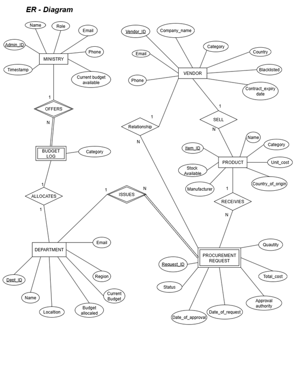
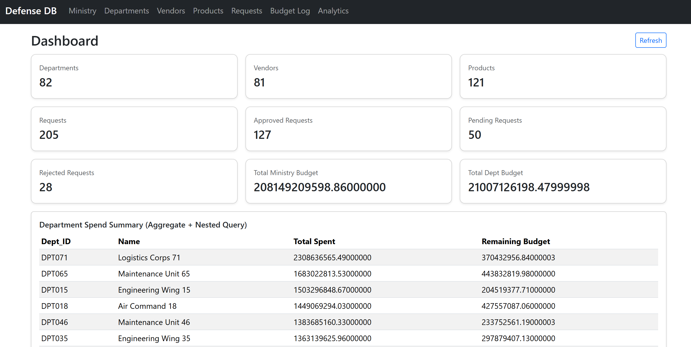
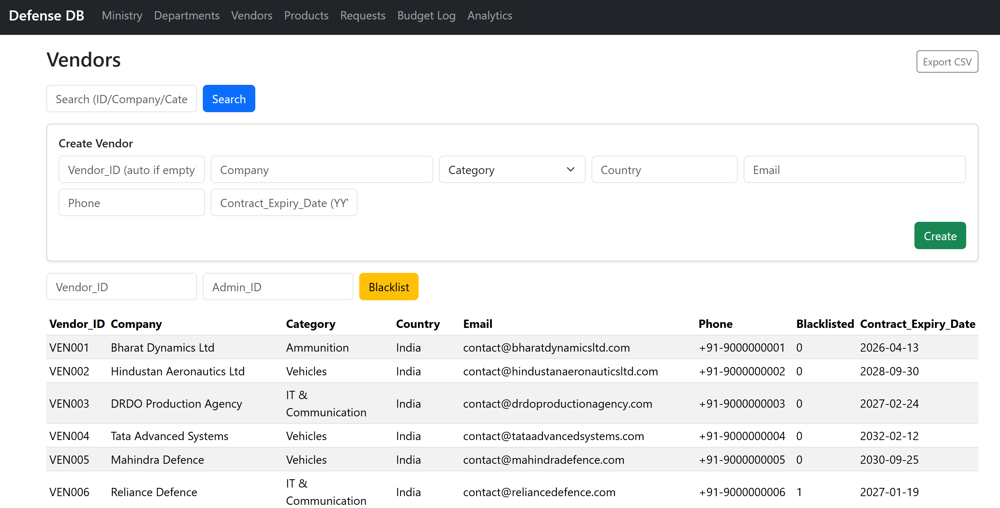
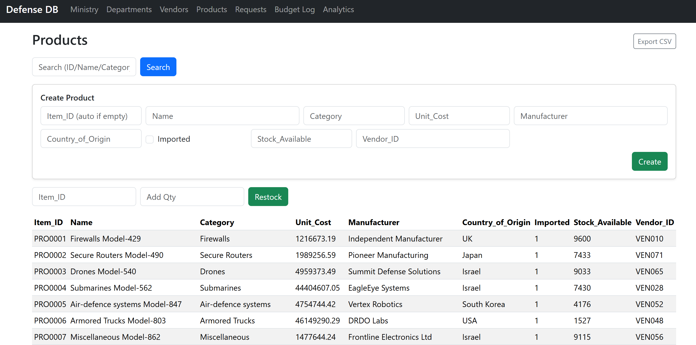
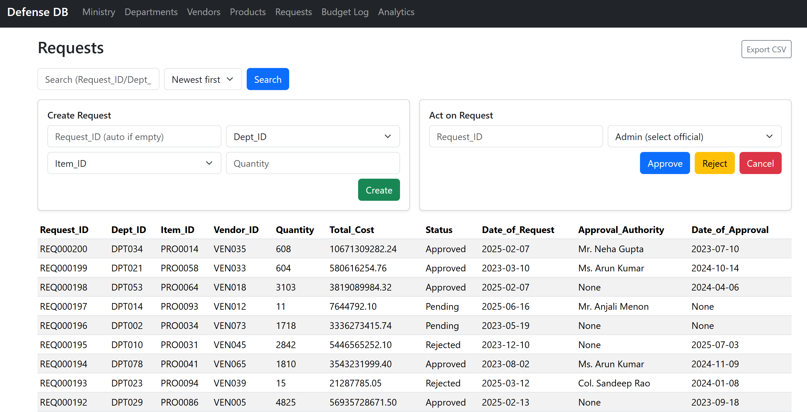

# DefenceDB

DefenceDB is a database-driven procurement and budget allocation system built with **MySQL** and a **Flask** web interface. It manages ministry officials, departments, vendors, products, procurement requests, approvals, and budget logs in one integrated workflow.

## Project Objective

The objective of this project is to provide a structured platform for:
- managing defense procurement data centrally,
- tracking departmental budgets and spending,
- enforcing approval workflows and stock checks,
- generating analytical insights from operational data.

## Core Features

- **Master Data Management**
  - Ministry officials
  - Departments
  - Vendors
  - Products
- **Procurement Workflow**
  - Create requests
  - Approve / reject requests
  - Cancel approved requests with budget/stock reversal
- **Budget & Audit Tracking**
  - Real-time department budget updates
  - Budget log entries for financial traceability
- **Analytics & SQL Demonstrations**
  - Joins, aggregates, and nested subqueries
  - Department KPIs, vendor performance, and high-value approvals
- **CSV Export**
  - Export tabular outputs from major modules

## Technology Stack

- **Backend:** Python, Flask
- **Database:** MySQL
- **Frontend:** HTML + Bootstrap
- **DB Logic:** SQL DDL/DML, functions, procedures, triggers

## Database Scope

Main entities in the schema:
- `MINISTRY`
- `DEPARTMENT`
- `VENDOR`
- `PRODUCT`
- `PROCUREMENT_REQUEST`
- `BUDGET_LOG`

## Repository Structure

```text
DefenceDB/
├── DefenseDB-DDL.sql
├── DefenseDB-DML.sql
├── Triggers-Functions-Procedures-DefenseDB.sql
├── requirements.txt
├── flask_app/
│   ├── __init__.py
│   ├── app.py
│   ├── db.py
│   └── templates/
└── images/
```

## Output Screenshots

### ER Diagram


### Dashboard


### Ministry Module


### Department KPIs


### Vendors Module


### Products Module


### Requests Module


### Budget Log


### Joins, Aggregates & Subqueries


### Joins & Nested Subqueries


## Steps to Run the Repository

### 1) Prerequisites
- Python 3.10+ (recommended)
- MySQL Server 8+
- MySQL client (`mysql`) available in terminal

### 2) Install dependencies

```bash
pip install -r requirements.txt
```

### 3) Create and seed the database

> Run these from the repository root.  
> `DefenseDB-DDL.sql` drops/recreates `defense_db`.

```bash
mysql -u <username> -p < DefenseDB-DDL.sql
mysql -u <username> -p < DefenseDB-DML.sql
mysql -u <username> -p < Triggers-Functions-Procedures-DefenseDB.sql
```

### 4) Configure environment variables

Set database connection variables before starting Flask:

```bash
export DB_HOST=localhost
export DB_PORT=3306
export DB_USER=<username>
export DB_PASSWORD=<password>
export DB_NAME=defense_db
export SECRET_KEY=change-me
```

### 5) Start the Flask application

```bash
flask --app flask_app run --debug
```

Or:

```bash
python -m flask --app flask_app run --debug
```

### 6) Open in browser

Visit:

```text
http://127.0.0.1:5000
```

Available modules:
- `/` (Dashboard)
- `/ministry`
- `/departments`
- `/vendors`
- `/products`
- `/requests`
- `/logs`
- `/analytics`

## SQL Script Purpose

- `DefenseDB-DDL.sql`: schema creation and constraints  
- `DefenseDB-DML.sql`: sample data population  
- `Triggers-Functions-Procedures-DefenseDB.sql`: advanced DB logic and workflow support
